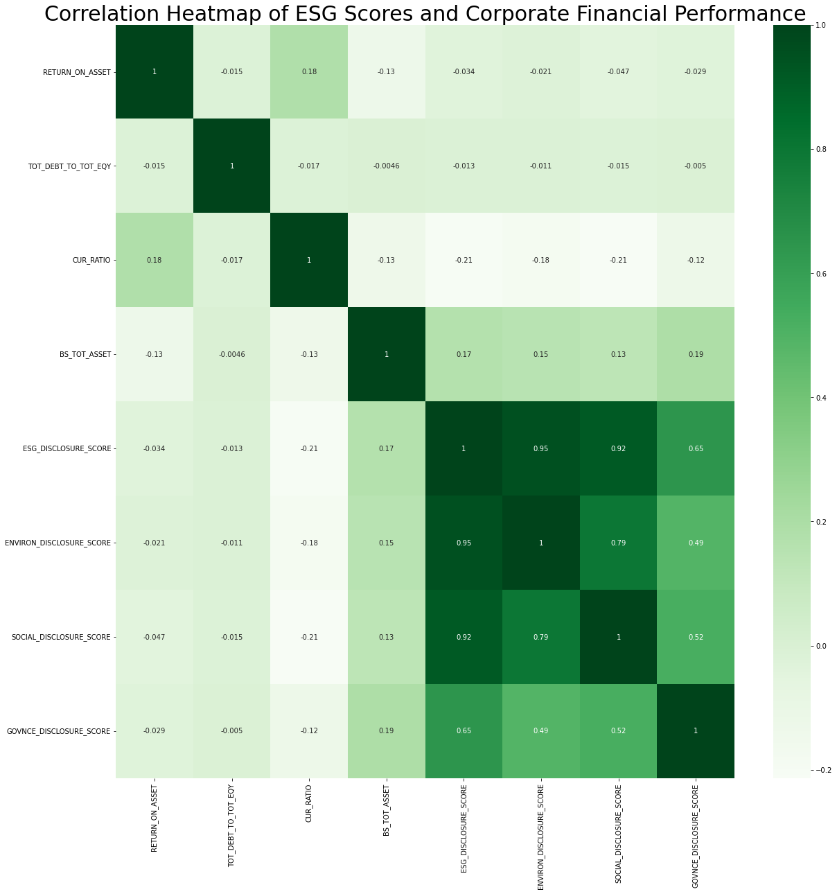
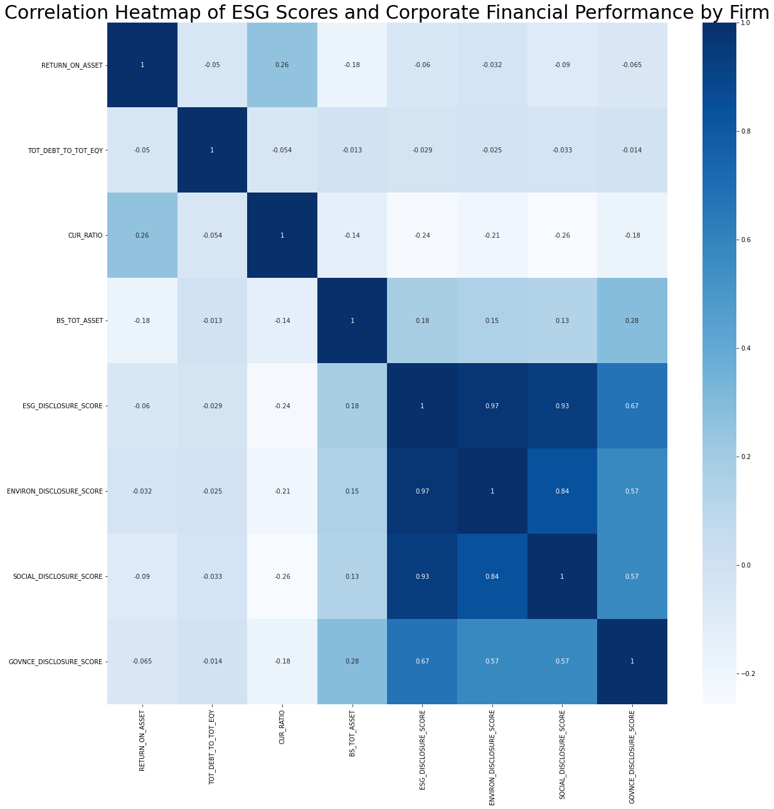
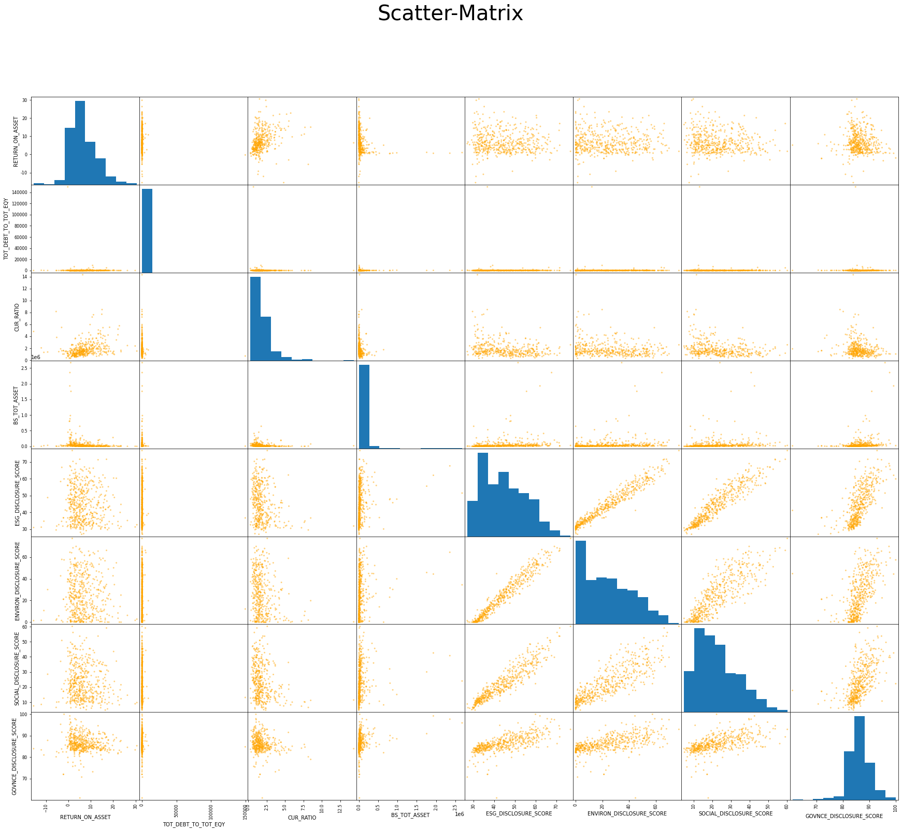
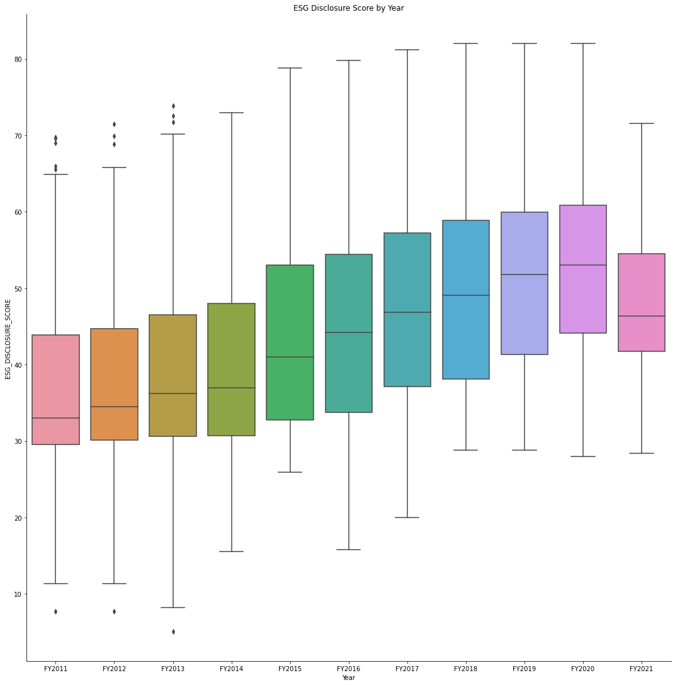
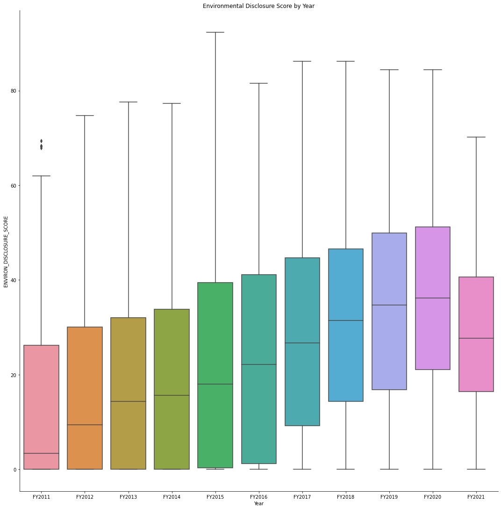
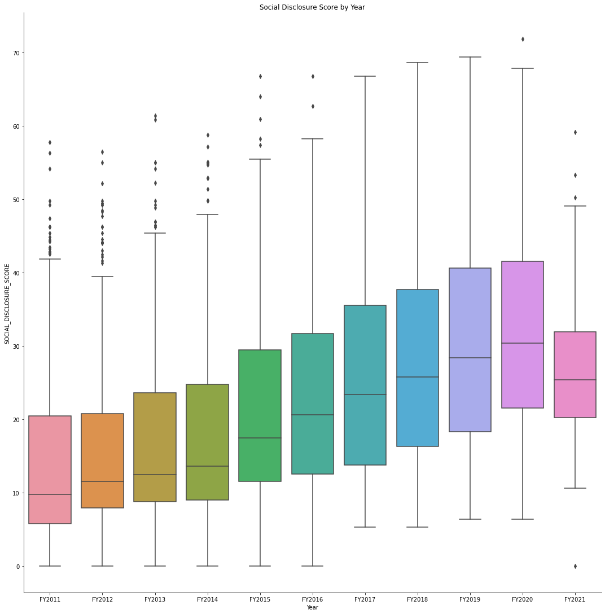
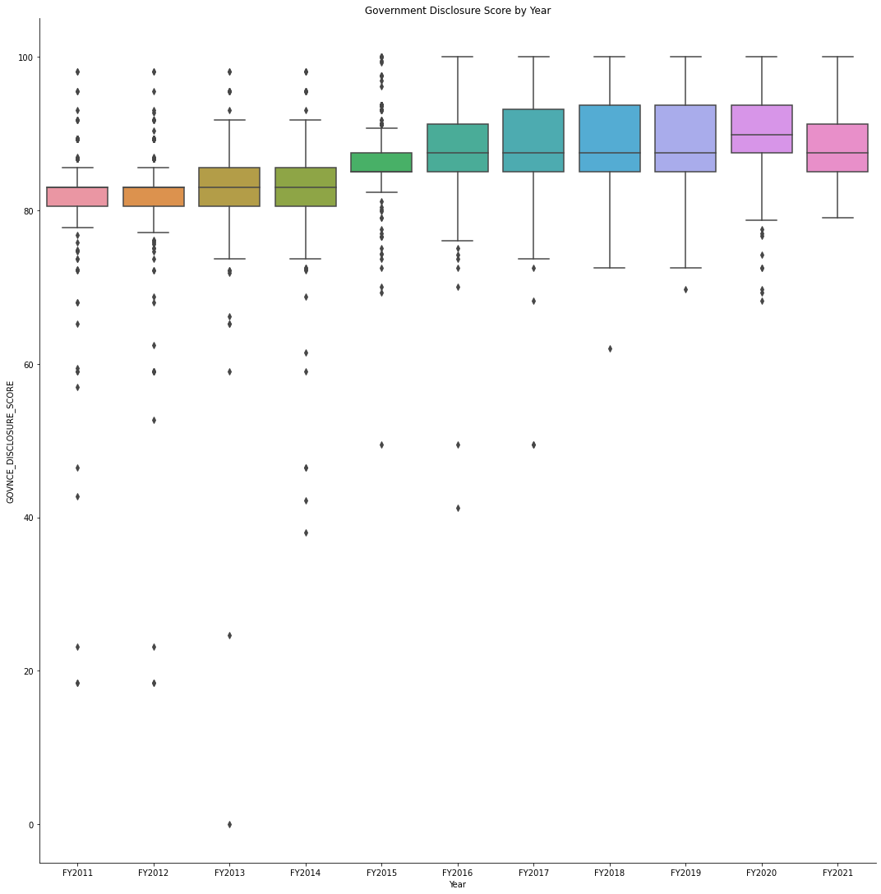
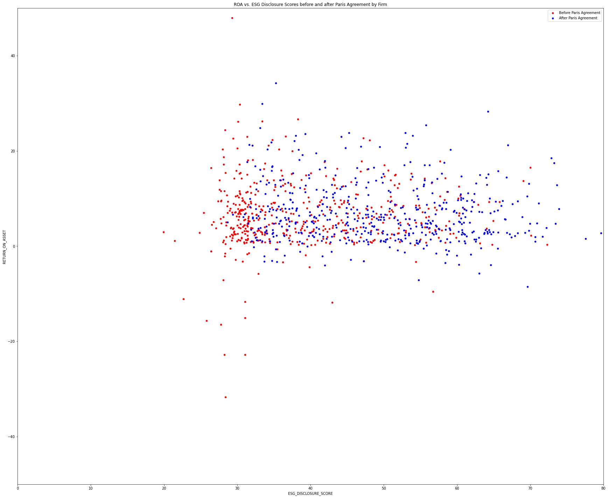
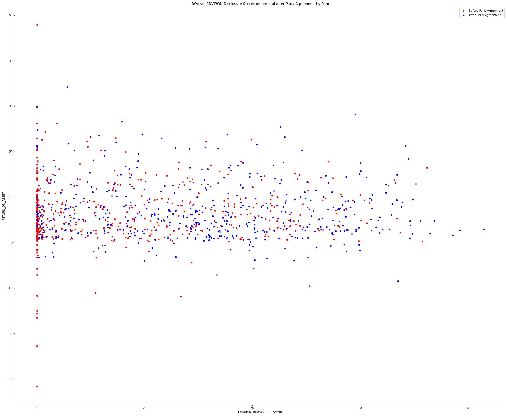

# Part 1: Data Collection 

## Data Source
All data including financial ratios, ESG ratings and default risk from 2011 to 2021 of S&P 500 firms is retrieved from Bloomberg Terminals in Rauch Business Center, Lehigh University. 

## Bloomberg Query Language 

BDH function building in Bloomberg & Excel 
- SPX Index
- A US =B4& " EQUITY"      
- =BDH(B3,$C$1,A3,A3,"Currency=USD","Period=FY","BEST_FPERIOD_OVERRIDE=FY","FILING_STATUS=MR","Sort=A","Dates=H","DateFormat=P","Fill=—","Direction=H","UseDPDF=Y")


# Part 2: Data Exploration 


```python
import pandas as pd
from statsmodels.formula.api import ols as sm_ols
import numpy as np
import seaborn as sns
from statsmodels.iolib.summary2 import summary_col
from pylab import rcParams
import matplotlib.pyplot as plt
import dataframe_image as dfi

```

## Overview of the dataframe 
- 10 years observations of 504 S&P500 firms 
- 10 variables, including 2 character variables and 8 numeric variables. 
- Missing value and outliers strategies are both ignore. 
- 


```python
# Load the dataset
ESG = pd.read_csv('input/ESG.csv')
# drop 2021 data first 
#Y_without2021 = ESG.drop(ESG[(ESG['Year'] == 'FY2021')].index)
# check the first 10 lines 
ESG.head(10)
```


<div>
<style scoped>
    .dataframe tbody tr th:only-of-type {
        vertical-align: middle;
    }

    .dataframe tbody tr th {
        vertical-align: top;
    }

    .dataframe thead th {
        text-align: right;
    }
</style>
<table border="1" class="dataframe">
  <thead>
    <tr style="text-align: right;">
      <th></th>
      <th>Year</th>
      <th>Tic</th>
      <th>RETURN_ON_ASSET</th>
      <th>TOT_DEBT_TO_TOT_EQY</th>
      <th>CUR_RATIO</th>
      <th>BS_TOT_ASSET</th>
      <th>ESG_DISCLOSURE_SCORE</th>
      <th>ENVIRON_DISCLOSURE_SCORE</th>
      <th>SOCIAL_DISCLOSURE_SCORE</th>
      <th>GOVNCE_DISCLOSURE_SCORE</th>
    </tr>
  </thead>
  <tbody>
    <tr>
      <th>0</th>
      <td>FY2011</td>
      <td>A US EQUITY</td>
      <td>10.7929</td>
      <td>50.6256</td>
      <td>3.0316</td>
      <td>9057</td>
      <td>55.7892</td>
      <td>44.2767</td>
      <td>36.185</td>
      <td>86.7851</td>
    </tr>
    <tr>
      <th>1</th>
      <td>FY2012</td>
      <td>A US EQUITY</td>
      <td>11.7695</td>
      <td>45.5545</td>
      <td>2.4453</td>
      <td>10536</td>
      <td>58.133</td>
      <td>48.8372</td>
      <td>49.4861</td>
      <td>76.0084</td>
    </tr>
    <tr>
      <th>2</th>
      <td>FY2013</td>
      <td>A US EQUITY</td>
      <td>6.9173</td>
      <td>51.0304</td>
      <td>3.1105</td>
      <td>10686</td>
      <td>62.9414</td>
      <td>49.6829</td>
      <td>52.2672</td>
      <td>86.7851</td>
    </tr>
    <tr>
      <th>3</th>
      <td>FY2014</td>
      <td>A US EQUITY</td>
      <td>5.1067</td>
      <td>31.3537</td>
      <td>3.2559</td>
      <td>10815</td>
      <td>64.8426</td>
      <td>54.7569</td>
      <td>52.9021</td>
      <td>86.7851</td>
    </tr>
    <tr>
      <th>4</th>
      <td>FY2015</td>
      <td>A US EQUITY</td>
      <td>4.384</td>
      <td>39.6882</td>
      <td>3.7766</td>
      <td>7479</td>
      <td>63.1124</td>
      <td>53.6696</td>
      <td>41.8077</td>
      <td>93.7387</td>
    </tr>
    <tr>
      <th>5</th>
      <td>FY2016</td>
      <td>A US EQUITY</td>
      <td>6.0499</td>
      <td>44.8422</td>
      <td>3.8466</td>
      <td>7794</td>
      <td>63.2532</td>
      <td>55.0891</td>
      <td>40.8102</td>
      <td>93.7387</td>
    </tr>
    <tr>
      <th>6</th>
      <td>FY2017</td>
      <td>A US EQUITY</td>
      <td>8.434</td>
      <td>41.5926</td>
      <td>3.3009</td>
      <td>8426</td>
      <td>63.1023</td>
      <td>51.7064</td>
      <td>43.7424</td>
      <td>93.7387</td>
    </tr>
    <tr>
      <th>7</th>
      <td>FY2018</td>
      <td>A US EQUITY</td>
      <td>3.7249</td>
      <td>39.3568</td>
      <td>3.2861</td>
      <td>8541</td>
      <td>55.759</td>
      <td>51.7064</td>
      <td>29.9879</td>
      <td>85.4606</td>
    </tr>
    <tr>
      <th>8</th>
      <td>FY2019</td>
      <td>A US EQUITY</td>
      <td>11.9046</td>
      <td>50.695</td>
      <td>1.5332</td>
      <td>9452</td>
      <td>64.9532</td>
      <td>62.7001</td>
      <td>38.3011</td>
      <td>93.7387</td>
    </tr>
    <tr>
      <th>9</th>
      <td>FY2020</td>
      <td>A US EQUITY</td>
      <td>7.5371</td>
      <td>52.0624</td>
      <td>2.3279</td>
      <td>9627</td>
      <td>63.3135</td>
      <td>62.7001</td>
      <td>33.3736</td>
      <td>93.7387</td>
    </tr>
  </tbody>
</table>
</div>


```python
# check the shape of the dataframe 
ESG.shape
```


    (5654, 10)


```python
# check the column names of the dataframe 
ESG.columns
```


    Index(['Year', 'Tic', 'RETURN_ON_ASSET', 'TOT_DEBT_TO_TOT_EQY', 'CUR_RATIO',
           'BS_TOT_ASSET', 'ESG_DISCLOSURE_SCORE', 'ENVIRON_DISCLOSURE_SCORE',
           'SOCIAL_DISCLOSURE_SCORE', 'GOVNCE_DISCLOSURE_SCORE'],
          dtype='object')


```python
# Convert data type of columns to numeric
ESG["RETURN_ON_ASSET"] = pd.to_numeric(ESG["RETURN_ON_ASSET"], errors='coerce')
ESG["TOT_DEBT_TO_TOT_EQY"] = pd.to_numeric(ESG["TOT_DEBT_TO_TOT_EQY"], errors='coerce')
ESG["CUR_RATIO"] = pd.to_numeric(ESG["CUR_RATIO"], errors='coerce')
ESG["BS_TOT_ASSET"] = pd.to_numeric(ESG["BS_TOT_ASSET"], errors='coerce')
ESG["ESG_DISCLOSURE_SCORE"] = pd.to_numeric(ESG["ESG_DISCLOSURE_SCORE"], errors='coerce')
ESG["ENVIRON_DISCLOSURE_SCORE"] = pd.to_numeric(ESG["ENVIRON_DISCLOSURE_SCORE"], errors='coerce')
ESG["SOCIAL_DISCLOSURE_SCORE"] = pd.to_numeric(ESG["SOCIAL_DISCLOSURE_SCORE"], errors='coerce')
ESG["SOCIAL_DISCLOSURE_SCORE"] = pd.to_numeric(ESG["SOCIAL_DISCLOSURE_SCORE"], errors='coerce')
ESG["GOVNCE_DISCLOSURE_SCORE"] = pd.to_numeric(ESG["GOVNCE_DISCLOSURE_SCORE"], errors='coerce')
```


```python
#get an overview of the dataset 
ESG_summary = ESG.describe().T.round(2)
ESG_summary
```


<div>
<style scoped>
    .dataframe tbody tr th:only-of-type {
        vertical-align: middle;
    }

    .dataframe tbody tr th {
        vertical-align: top;
    }

    .dataframe thead th {
        text-align: right;
    }
</style>
<table border="1" class="dataframe">
  <thead>
    <tr style="text-align: right;">
      <th></th>
      <th>count</th>
      <th>mean</th>
      <th>std</th>
      <th>min</th>
      <th>25%</th>
      <th>50%</th>
      <th>75%</th>
      <th>max</th>
    </tr>
  </thead>
  <tbody>
    <tr>
      <th>RETURN_ON_ASSET</th>
      <td>5485.0</td>
      <td>6.71</td>
      <td>7.86</td>
      <td>-61.82</td>
      <td>2.46</td>
      <td>5.68</td>
      <td>10.26</td>
      <td>76.25</td>
    </tr>
    <tr>
      <th>TOT_DEBT_TO_TOT_EQY</th>
      <td>5306.0</td>
      <td>279.13</td>
      <td>6292.86</td>
      <td>0.00</td>
      <td>36.14</td>
      <td>72.01</td>
      <td>127.25</td>
      <td>446669.11</td>
    </tr>
    <tr>
      <th>CUR_RATIO</th>
      <td>4668.0</td>
      <td>1.88</td>
      <td>1.49</td>
      <td>0.14</td>
      <td>1.05</td>
      <td>1.47</td>
      <td>2.20</td>
      <td>19.27</td>
    </tr>
    <tr>
      <th>BS_TOT_ASSET</th>
      <td>5522.0</td>
      <td>66906.61</td>
      <td>222183.21</td>
      <td>0.00</td>
      <td>6504.87</td>
      <td>16998.50</td>
      <td>43208.88</td>
      <td>3743567.00</td>
    </tr>
    <tr>
      <th>ESG_DISCLOSURE_SCORE</th>
      <td>5006.0</td>
      <td>44.58</td>
      <td>12.44</td>
      <td>5.09</td>
      <td>32.84</td>
      <td>42.99</td>
      <td>54.38</td>
      <td>82.01</td>
    </tr>
    <tr>
      <th>ENVIRON_DISCLOSURE_SCORE</th>
      <td>5006.0</td>
      <td>24.57</td>
      <td>21.50</td>
      <td>0.00</td>
      <td>1.16</td>
      <td>21.90</td>
      <td>40.89</td>
      <td>92.30</td>
    </tr>
    <tr>
      <th>SOCIAL_DISCLOSURE_SCORE</th>
      <td>5006.0</td>
      <td>22.73</td>
      <td>13.92</td>
      <td>0.00</td>
      <td>11.55</td>
      <td>20.07</td>
      <td>32.47</td>
      <td>71.86</td>
    </tr>
    <tr>
      <th>GOVNCE_DISCLOSURE_SCORE</th>
      <td>5006.0</td>
      <td>86.29</td>
      <td>6.31</td>
      <td>0.00</td>
      <td>83.02</td>
      <td>85.04</td>
      <td>89.28</td>
      <td>100.00</td>
    </tr>
  </tbody>
</table>
</div>


```python
#export the summary table 
dfi.export(ESG_summary, 'pics/ESG_summary.png')
```

    [0504/013138.244704:INFO:headless_shell.cc(659)] Written to file /var/folders/pb/6yhd532s4sg99gk4h46pc60m0000gn/T/tmpwngabwms/temp.png.


```python
#get an overview of the dataset by firms 
ESG_tic= ESG.groupby(['Tic']).mean()
ESG_tic_summary=ESG_tic.describe().T.round(2)
ESG_tic_summary
```


<div>
<style scoped>
    .dataframe tbody tr th:only-of-type {
        vertical-align: middle;
    }

    .dataframe tbody tr th {
        vertical-align: top;
    }

    .dataframe thead th {
        text-align: right;
    }
</style>
<table border="1" class="dataframe">
  <thead>
    <tr style="text-align: right;">
      <th></th>
      <th>count</th>
      <th>mean</th>
      <th>std</th>
      <th>min</th>
      <th>25%</th>
      <th>50%</th>
      <th>75%</th>
      <th>max</th>
    </tr>
  </thead>
  <tbody>
    <tr>
      <th>RETURN_ON_ASSET</th>
      <td>502.0</td>
      <td>6.68</td>
      <td>5.80</td>
      <td>-15.54</td>
      <td>2.74</td>
      <td>5.64</td>
      <td>9.83</td>
      <td>30.58</td>
    </tr>
    <tr>
      <th>TOT_DEBT_TO_TOT_EQY</th>
      <td>500.0</td>
      <td>508.90</td>
      <td>6720.93</td>
      <td>0.10</td>
      <td>43.74</td>
      <td>79.67</td>
      <td>140.75</td>
      <td>149707.05</td>
    </tr>
    <tr>
      <th>CUR_RATIO</th>
      <td>427.0</td>
      <td>1.88</td>
      <td>1.33</td>
      <td>0.29</td>
      <td>1.09</td>
      <td>1.53</td>
      <td>2.21</td>
      <td>14.31</td>
    </tr>
    <tr>
      <th>BS_TOT_ASSET</th>
      <td>503.0</td>
      <td>66466.27</td>
      <td>218518.40</td>
      <td>384.13</td>
      <td>7416.77</td>
      <td>17256.03</td>
      <td>44234.91</td>
      <td>2675295.73</td>
    </tr>
    <tr>
      <th>ESG_DISCLOSURE_SCORE</th>
      <td>501.0</td>
      <td>44.66</td>
      <td>10.32</td>
      <td>27.04</td>
      <td>35.75</td>
      <td>43.36</td>
      <td>52.43</td>
      <td>76.84</td>
    </tr>
    <tr>
      <th>ENVIRON_DISCLOSURE_SCORE</th>
      <td>501.0</td>
      <td>24.74</td>
      <td>18.49</td>
      <td>0.00</td>
      <td>8.00</td>
      <td>22.76</td>
      <td>38.63</td>
      <td>77.30</td>
    </tr>
    <tr>
      <th>SOCIAL_DISCLOSURE_SCORE</th>
      <td>501.0</td>
      <td>22.77</td>
      <td>11.13</td>
      <td>4.77</td>
      <td>13.57</td>
      <td>20.39</td>
      <td>30.27</td>
      <td>60.19</td>
    </tr>
    <tr>
      <th>GOVNCE_DISCLOSURE_SCORE</th>
      <td>501.0</td>
      <td>86.32</td>
      <td>3.93</td>
      <td>61.02</td>
      <td>84.20</td>
      <td>85.86</td>
      <td>88.52</td>
      <td>100.00</td>
    </tr>
  </tbody>
</table>
</div>


```python
#export the summary table 
dfi.export(ESG_tic_summary, 'pics/ESG_tic_summary.png')
```

    [0504/013141.648395:INFO:headless_shell.cc(659)] Written to file /var/folders/pb/6yhd532s4sg99gk4h46pc60m0000gn/T/tmpegcdf7xc/temp.png.


```python
#check for outliers 
e=ESG.drop(columns=['Year', 'Tic',])
e.columns
def outlier_report(df,vars_to_examine=None,color='red',thres=4,
                   return_df=False,no_print=False):
    '''
    Parameters
    ----------
    df : DATAFRAME
        Input dataframe
    vars_to_examine : LIST, optional
        List of variables to examine from dataframe. The default is df.columns.
    color : STRING, optional
        Color for cell highlighting. The default is 'red'.
    thres : int, optional
        Highlight cells where z score is above thres. The default is 4.
    return_df : Boolean, optional
        If true, will return the df obj (without styling) for further use. 
        The default is False.
    no_print : Boolean, optional
        If true, will not print. 
        The default is False.
    
    Displays (if no_print=False)
    -------
    Table with distribution of z-scores of variables of interest. 
    
    Returns (if return_df=True)
    -------
    Table with distribution of z-scores of variables of interest (without styling).     
    '''
        
    def highlight_extreme(s):
        '''
        Highlight extreme values in a series.
        '''
        is_extreme = abs(s) > thres
        return ['background-color: '+color if v else '' for v in is_extreme]
    
    if vars_to_examine==None:
        vars_to_examine=df.columns
    
    _tab = (
            # compute z scores
            ((df[vars_to_examine] - df[vars_to_examine].mean())/df[vars_to_examine].std())
            # output dist of z   
            .describe(percentiles=[.01,.05,.25,.5,.75,.95,.99]).T
            # add a new column = highest of min and max column
            .assign(max_z_abs = lambda x: x[['min','max']].abs().max(axis=1))
            # now sort on it
            .sort_values('max_z_abs',ascending = False)
    )
    
    if no_print == False:
        
        fdict = { c:('{:,.2f}' if c != 'count' else  '{:,.0f}') for c in _tab.columns   }

        display(_tab
             .style.format(fdict)
                   .apply(highlight_extreme, 
                          subset=['mean', 'std', 'min', '1%', '5%', '25%', '50%', '75%', '95%','99%', 'max', 'max_z_abs'])
        ) 
    
    if return_df == True:
        return _tab
    
    
vars_to_check = ['RETURN_ON_ASSET', 'TOT_DEBT_TO_TOT_EQY', 'CUR_RATIO',
       'BS_TOT_ASSET', 'ESG_DISCLOSURE_SCORE', 'ENVIRON_DISCLOSURE_SCORE',
       'SOCIAL_DISCLOSURE_SCORE', 'GOVNCE_DISCLOSURE_SCORE']
outlier_report(e,vars_to_check,thres=4)
#outlier_report_summary = pd.DataFrame()

```


<style type="text/css">
#T_9c0e1_row0_col11, #T_9c0e1_row0_col12, #T_9c0e1_row1_col11, #T_9c0e1_row1_col12, #T_9c0e1_row2_col3, #T_9c0e1_row2_col12, #T_9c0e1_row3_col10, #T_9c0e1_row3_col11, #T_9c0e1_row3_col12, #T_9c0e1_row4_col3, #T_9c0e1_row4_col11, #T_9c0e1_row4_col12 {
  background-color: red;
}
</style>
<table id="T_9c0e1_">
  <thead>
    <tr>
      <th class="blank level0" >&nbsp;</th>
      <th class="col_heading level0 col0" >count</th>
      <th class="col_heading level0 col1" >mean</th>
      <th class="col_heading level0 col2" >std</th>
      <th class="col_heading level0 col3" >min</th>
      <th class="col_heading level0 col4" >1%</th>
      <th class="col_heading level0 col5" >5%</th>
      <th class="col_heading level0 col6" >25%</th>
      <th class="col_heading level0 col7" >50%</th>
      <th class="col_heading level0 col8" >75%</th>
      <th class="col_heading level0 col9" >95%</th>
      <th class="col_heading level0 col10" >99%</th>
      <th class="col_heading level0 col11" >max</th>
      <th class="col_heading level0 col12" >max_z_abs</th>
    </tr>
  </thead>
  <tbody>
    <tr>
      <th id="T_9c0e1_level0_row0" class="row_heading level0 row0" >TOT_DEBT_TO_TOT_EQY</th>
      <td id="T_9c0e1_row0_col0" class="data row0 col0" >5,306</td>
      <td id="T_9c0e1_row0_col1" class="data row0 col1" >0.00</td>
      <td id="T_9c0e1_row0_col2" class="data row0 col2" >1.00</td>
      <td id="T_9c0e1_row0_col3" class="data row0 col3" >-0.04</td>
      <td id="T_9c0e1_row0_col4" class="data row0 col4" >-0.04</td>
      <td id="T_9c0e1_row0_col5" class="data row0 col5" >-0.04</td>
      <td id="T_9c0e1_row0_col6" class="data row0 col6" >-0.04</td>
      <td id="T_9c0e1_row0_col7" class="data row0 col7" >-0.03</td>
      <td id="T_9c0e1_row0_col8" class="data row0 col8" >-0.02</td>
      <td id="T_9c0e1_row0_col9" class="data row0 col9" >0.02</td>
      <td id="T_9c0e1_row0_col10" class="data row0 col10" >0.24</td>
      <td id="T_9c0e1_row0_col11" class="data row0 col11" >70.94</td>
      <td id="T_9c0e1_row0_col12" class="data row0 col12" >70.94</td>
    </tr>
    <tr>
      <th id="T_9c0e1_level0_row1" class="row_heading level0 row1" >BS_TOT_ASSET</th>
      <td id="T_9c0e1_row1_col0" class="data row1 col0" >5,522</td>
      <td id="T_9c0e1_row1_col1" class="data row1 col1" >-0.00</td>
      <td id="T_9c0e1_row1_col2" class="data row1 col2" >1.00</td>
      <td id="T_9c0e1_row1_col3" class="data row1 col3" >-0.30</td>
      <td id="T_9c0e1_row1_col4" class="data row1 col4" >-0.30</td>
      <td id="T_9c0e1_row1_col5" class="data row1 col5" >-0.29</td>
      <td id="T_9c0e1_row1_col6" class="data row1 col6" >-0.27</td>
      <td id="T_9c0e1_row1_col7" class="data row1 col7" >-0.22</td>
      <td id="T_9c0e1_row1_col8" class="data row1 col8" >-0.11</td>
      <td id="T_9c0e1_row1_col9" class="data row1 col9" >0.78</td>
      <td id="T_9c0e1_row1_col10" class="data row1 col10" >3.82</td>
      <td id="T_9c0e1_row1_col11" class="data row1 col11" >16.55</td>
      <td id="T_9c0e1_row1_col12" class="data row1 col12" >16.55</td>
    </tr>
    <tr>
      <th id="T_9c0e1_level0_row2" class="row_heading level0 row2" >GOVNCE_DISCLOSURE_SCORE</th>
      <td id="T_9c0e1_row2_col0" class="data row2 col0" >5,006</td>
      <td id="T_9c0e1_row2_col1" class="data row2 col1" >0.00</td>
      <td id="T_9c0e1_row2_col2" class="data row2 col2" >1.00</td>
      <td id="T_9c0e1_row2_col3" class="data row2 col3" >-13.68</td>
      <td id="T_9c0e1_row2_col4" class="data row2 col4" >-2.57</td>
      <td id="T_9c0e1_row2_col5" class="data row2 col5" >-0.91</td>
      <td id="T_9c0e1_row2_col6" class="data row2 col6" >-0.52</td>
      <td id="T_9c0e1_row2_col7" class="data row2 col7" >-0.20</td>
      <td id="T_9c0e1_row2_col8" class="data row2 col8" >0.47</td>
      <td id="T_9c0e1_row2_col9" class="data row2 col9" >1.18</td>
      <td id="T_9c0e1_row2_col10" class="data row2 col10" >2.17</td>
      <td id="T_9c0e1_row2_col11" class="data row2 col11" >2.17</td>
      <td id="T_9c0e1_row2_col12" class="data row2 col12" >13.68</td>
    </tr>
    <tr>
      <th id="T_9c0e1_level0_row3" class="row_heading level0 row3" >CUR_RATIO</th>
      <td id="T_9c0e1_row3_col0" class="data row3 col0" >4,668</td>
      <td id="T_9c0e1_row3_col1" class="data row3 col1" >-0.00</td>
      <td id="T_9c0e1_row3_col2" class="data row3 col2" >1.00</td>
      <td id="T_9c0e1_row3_col3" class="data row3 col3" >-1.17</td>
      <td id="T_9c0e1_row3_col4" class="data row3 col4" >-1.03</td>
      <td id="T_9c0e1_row3_col5" class="data row3 col5" >-0.83</td>
      <td id="T_9c0e1_row3_col6" class="data row3 col6" >-0.56</td>
      <td id="T_9c0e1_row3_col7" class="data row3 col7" >-0.27</td>
      <td id="T_9c0e1_row3_col8" class="data row3 col8" >0.22</td>
      <td id="T_9c0e1_row3_col9" class="data row3 col9" >1.70</td>
      <td id="T_9c0e1_row3_col10" class="data row3 col10" >4.02</td>
      <td id="T_9c0e1_row3_col11" class="data row3 col11" >11.66</td>
      <td id="T_9c0e1_row3_col12" class="data row3 col12" >11.66</td>
    </tr>
    <tr>
      <th id="T_9c0e1_level0_row4" class="row_heading level0 row4" >RETURN_ON_ASSET</th>
      <td id="T_9c0e1_row4_col0" class="data row4 col0" >5,485</td>
      <td id="T_9c0e1_row4_col1" class="data row4 col1" >-0.00</td>
      <td id="T_9c0e1_row4_col2" class="data row4 col2" >1.00</td>
      <td id="T_9c0e1_row4_col3" class="data row4 col3" >-8.72</td>
      <td id="T_9c0e1_row4_col4" class="data row4 col4" >-2.89</td>
      <td id="T_9c0e1_row4_col5" class="data row4 col5" >-1.06</td>
      <td id="T_9c0e1_row4_col6" class="data row4 col6" >-0.54</td>
      <td id="T_9c0e1_row4_col7" class="data row4 col7" >-0.13</td>
      <td id="T_9c0e1_row4_col8" class="data row4 col8" >0.45</td>
      <td id="T_9c0e1_row4_col9" class="data row4 col9" >1.65</td>
      <td id="T_9c0e1_row4_col10" class="data row4 col10" >2.83</td>
      <td id="T_9c0e1_row4_col11" class="data row4 col11" >8.85</td>
      <td id="T_9c0e1_row4_col12" class="data row4 col12" >8.85</td>
    </tr>
    <tr>
      <th id="T_9c0e1_level0_row5" class="row_heading level0 row5" >SOCIAL_DISCLOSURE_SCORE</th>
      <td id="T_9c0e1_row5_col0" class="data row5 col0" >5,006</td>
      <td id="T_9c0e1_row5_col1" class="data row5 col1" >0.00</td>
      <td id="T_9c0e1_row5_col2" class="data row5 col2" >1.00</td>
      <td id="T_9c0e1_row5_col3" class="data row5 col3" >-1.63</td>
      <td id="T_9c0e1_row5_col4" class="data row5 col4" >-1.63</td>
      <td id="T_9c0e1_row5_col5" class="data row5 col5" >-1.25</td>
      <td id="T_9c0e1_row5_col6" class="data row5 col6" >-0.80</td>
      <td id="T_9c0e1_row5_col7" class="data row5 col7" >-0.19</td>
      <td id="T_9c0e1_row5_col8" class="data row5 col8" >0.70</td>
      <td id="T_9c0e1_row5_col9" class="data row5 col9" >1.85</td>
      <td id="T_9c0e1_row5_col10" class="data row5 col10" >2.41</td>
      <td id="T_9c0e1_row5_col11" class="data row5 col11" >3.53</td>
      <td id="T_9c0e1_row5_col12" class="data row5 col12" >3.53</td>
    </tr>
    <tr>
      <th id="T_9c0e1_level0_row6" class="row_heading level0 row6" >ESG_DISCLOSURE_SCORE</th>
      <td id="T_9c0e1_row6_col0" class="data row6 col0" >5,006</td>
      <td id="T_9c0e1_row6_col1" class="data row6 col1" >-0.00</td>
      <td id="T_9c0e1_row6_col2" class="data row6 col2" >1.00</td>
      <td id="T_9c0e1_row6_col3" class="data row6 col3" >-3.18</td>
      <td id="T_9c0e1_row6_col4" class="data row6 col4" >-1.42</td>
      <td id="T_9c0e1_row6_col5" class="data row6 col5" >-1.27</td>
      <td id="T_9c0e1_row6_col6" class="data row6 col6" >-0.94</td>
      <td id="T_9c0e1_row6_col7" class="data row6 col7" >-0.13</td>
      <td id="T_9c0e1_row6_col8" class="data row6 col8" >0.79</td>
      <td id="T_9c0e1_row6_col9" class="data row6 col9" >1.74</td>
      <td id="T_9c0e1_row6_col10" class="data row6 col10" >2.26</td>
      <td id="T_9c0e1_row6_col11" class="data row6 col11" >3.01</td>
      <td id="T_9c0e1_row6_col12" class="data row6 col12" >3.18</td>
    </tr>
    <tr>
      <th id="T_9c0e1_level0_row7" class="row_heading level0 row7" >ENVIRON_DISCLOSURE_SCORE</th>
      <td id="T_9c0e1_row7_col0" class="data row7 col0" >5,006</td>
      <td id="T_9c0e1_row7_col1" class="data row7 col1" >-0.00</td>
      <td id="T_9c0e1_row7_col2" class="data row7 col2" >1.00</td>
      <td id="T_9c0e1_row7_col3" class="data row7 col3" >-1.14</td>
      <td id="T_9c0e1_row7_col4" class="data row7 col4" >-1.14</td>
      <td id="T_9c0e1_row7_col5" class="data row7 col5" >-1.14</td>
      <td id="T_9c0e1_row7_col6" class="data row7 col6" >-1.09</td>
      <td id="T_9c0e1_row7_col7" class="data row7 col7" >-0.12</td>
      <td id="T_9c0e1_row7_col8" class="data row7 col8" >0.76</td>
      <td id="T_9c0e1_row7_col9" class="data row7 col9" >1.80</td>
      <td id="T_9c0e1_row7_col10" class="data row7 col10" >2.22</td>
      <td id="T_9c0e1_row7_col11" class="data row7 col11" >3.15</td>
      <td id="T_9c0e1_row7_col12" class="data row7 col12" >3.15</td>
    </tr>
  </tbody>
</table>


```python
# Check for missing values 

missing_values_report = (
    ( # these lines do the calculation - what % of missing values are there for each var
        ESG.isna()      # ccm.isna() TURNS every obs/variable = 1 when its missing and 0 else
       .sum(axis=0)     # count the number of na for each variable (now data is 1 obs per column = # missing)
        /len(ESG)       # convert # missing to % missing 
        *100            # report as percentage
    ) 
    # you can stop here and report this...
    # but I wanted to format it a bit...
    .sort_values(ascending=False)[:13]
    .to_frame(name='% missing') # the next line only works on a frame, and because pandas sees only 1 variable at this pt
    .style.format("{:.1f}")     # in the code, it calls this a "series" type object, so convert it to dataframe type object
)
#
```


```python
## export missing value report 
dfi.export(missing_values_report,'pics/missing_values_report.png')
```

    [0504/013145.043379:INFO:headless_shell.cc(659)] Written to file /var/folders/pb/6yhd532s4sg99gk4h46pc60m0000gn/T/tmpgh8_ng_e/temp.png.


# Part 3: Data Visualization

## Correlation Heatmap
- All four ESG scores have positive correlation with the companies total assets. 
- All four ESG scores have slightly negative correlations with profitabiltiy (ROA), liquidity (current) and leverage(Debt/Equity) 
- The findings are consistent when taking the mean of the values by firm. 


```python
# get the correlation heatmap 
rcParams['figure.figsize'] = 20, 20
corr = ESG.corr()
ax=sns.heatmap(corr, cmap="Greens", annot=True)
plt.title('Correlation Heatmap of ESG Scores and Corporate Financial Performance', fontsize=30)
plt.savefig('pics/Correlation_Heatmap')
plt.show()
```


    

    


```python
## correlations By firms 
# get the correlation heatmap 
rcParams['figure.figsize'] = 20, 20
corr = ESG_tic.corr()
ax=sns.heatmap(corr, cmap="Blues", annot=True)
plt.title('Correlation Heatmap of ESG Scores and Corporate Financial Performance by Firm', fontsize=30)
plt.savefig('pics/Correlation_Heatmap_byFirm')
plt.show()

```


    

    


## Scatter-Matrix of ESG ratings and Financial Performance by Firm


```python
rcParams['figure.figsize'] = 30, 25
ax = pd.plotting.scatter_matrix(ESG_tic, c='orange')
plt.suptitle('Scatter-Matrix', fontsize=40)
plt.savefig('pics/Scatter-Matrix')
plt.show()
```


    

    


```python

```

## Boxplot


```python
#boxplot of ESG total disclosure score by Year 
ax=sns.catplot(y='ESG_DISCLOSURE_SCORE',x='Year',kind='box',data=ESG,height=15,aspect=15/15)
#sns.set(rc={'figure.figsize': (25, 25)})
ax.set(title='ESG Disclosure Score by Year')
plt.savefig('pics/ESG Disclosure Score by Year')
plt.show()
```


    

    


```python
#boxplot of Environmental total disclosure score by Year 
ax=sns.catplot(y='ENVIRON_DISCLOSURE_SCORE',x='Year',kind='box',data=ESG,height=15,aspect=15/15)
#sns.set(rc={'figure.figsize': (25, 25)})
ax.set(title='Environmental Disclosure Score by Year')
plt.savefig('pics/Environmental Disclosure Score by Year')
plt.show()
```


    

    


```python
#boxplot of Social disclosure score by Year 
ax=sns.catplot(y='SOCIAL_DISCLOSURE_SCORE',x='Year',kind='box',data=ESG,height=15,aspect=15/15)
#sns.set(rc={'figure.figsize': (25, 25)})
ax.set(title='Social Disclosure Score by Year')
plt.savefig('Social Disclosure Score by Year')
plt.show()
```


    

    


```python
#boxplot of Government disclosure score by Year 
ax=sns.catplot(y='GOVNCE_DISCLOSURE_SCORE',x='Year',kind='box',data=ESG,height=15,aspect=15/15)
#sns.set(rc={'figure.figsize': (25, 25)})
ax.set(title='Government Disclosure Score by Year')
plt.savefig('pics/Government Disclosure Score by Year')
plt.show()
```


    

    


## Pre-Paris Agreement and Post Paris Agreement Comparison 


```python
#slice the dataset into pre-paris agreement (2011-2015) and post paris agreement (2016-2020)
Y_2011_2015 = ESG[ESG['Year'].isin(['FY2011','FY2012','FY2013','FY2014','FY2015'])]
Y_2011_2015_tic=Y_2011_2015.groupby('Tic').mean()

Y_2016_2021 = ESG[ESG['Year'].isin(['FY2016','FY2017','FY2018','FY2019','FY2020','FY2021'])]
Y_2016_2021_tic=Y_2016_2021.groupby('Tic').mean()

```


```python
# scatterplot of ROA vs. ESG total score by firm
ax=Y_2011_2015_tic.plot(kind='scatter',x = 'ESG_DISCLOSURE_SCORE',
                    y = 'RETURN_ON_ASSET',
                    color='red',
                    xlim=(0, 80),
                    ylim=(-50, 50),
                    label='Before Paris Agreement'
                    )

Y_2016_2021_tic.plot(kind='scatter',x = 'ESG_DISCLOSURE_SCORE',
                    y = 'RETURN_ON_ASSET',
                    color='blue',
                    xlim=(0, 80),
                    ylim=(-50, 50),
                    label='After Paris Agreement',
                    ax=ax
                    )
ax.set(title='ROA vs. ESG Disclosure Scores before and after Paris Agreement by Firm')
plt.savefig('before and after Paris Agreement by Firm.png')
plt.show()
```


    

    


```python
# scatterplot of ROA vs. Environment total score by firm
ax=Y_2011_2015_tic.plot(kind='scatter',x = 'ENVIRON_DISCLOSURE_SCORE',
                    y = 'RETURN_ON_ASSET',
                    color='red',
                   # xlim=(0, 80),
                   # ylim=(-50, 50),
                    label='Before Paris Agreement'
                    )

Y_2016_2021_tic.plot(kind='scatter',x = 'ENVIRON_DISCLOSURE_SCORE',
                    y = 'RETURN_ON_ASSET',
                    color='blue',
                   # xlim=(0, 80),
                   # ylim=(-50, 50),
                    label='After Paris Agreement',
                    ax=ax
                    )
ax.set(title='ROA vs. ENVIRON Disclosure Scores before and after Paris Agreement by Firm')
plt.savefig('ENVIRON_before and after Paris Agreement by Firm.png')
plt.show()
```


    

    


# Part 4: Regression Analysis
## 2011-2020 ROA Regression Model


```python
reg1 = sm_ols('RETURN_ON_ASSET ~ ESG_DISCLOSURE_SCORE+TOT_DEBT_TO_TOT_EQY+CUR_RATIO+np.log(BS_TOT_ASSET)', data=ESG_tic).fit()

reg2= sm_ols('RETURN_ON_ASSET ~ ENVIRON_DISCLOSURE_SCORE+TOT_DEBT_TO_TOT_EQY+CUR_RATIO+np.log(BS_TOT_ASSET)',  data=ESG_tic).fit()

reg3= sm_ols('RETURN_ON_ASSET~SOCIAL_DISCLOSURE_SCORE+TOT_DEBT_TO_TOT_EQY+CUR_RATIO+np.log(BS_TOT_ASSET)',  data=ESG_tic).fit()

reg4= sm_ols('RETURN_ON_ASSET~GOVNCE_DISCLOSURE_SCORE+TOT_DEBT_TO_TOT_EQY+CUR_RATIO+np.log(BS_TOT_ASSET)',  data=ESG_tic).fit()
```


```python
info_dict={'R-squared' : lambda x: f"{x.rsquared:.2f}",
           'Adj R-squared' : lambda x: f"{x.rsquared_adj:.2f}",
           'No. observations' : lambda x: f"{int(x.nobs):d}"}

# This summary col function combines a bunch of regressions into one nice table
print('='*108)
print(summary_col(results=[reg1,reg2,reg3,reg4], # list the result obj here
                  float_format='%0.5f',
                  stars = True, # stars are easy way to see if anything is statistically significant
                  model_names=['ESG','ENVIRON',' SOCIAL','GOVNCE'], 
                  info_dict=info_dict,
                  regressor_order=[ 'Intercept','ESG_DISCLOSURE_SCORE','ENVIRON_DISCLOSURE_SCORE',
                                   'SOCIAL_DISCLOSURE_SCORE','GOVNCE_DISCLOSURE_SCORE',
                                   'TOT_DEBT_TO_TOT_EQY','CUR_RATIO',
                                  'BS_TOT_ASSET']
                  )
     )
```

    ============================================================================================================
    
    ========================================================================
                                 ESG       ENVIRON      SOCIAL      GOVNCE  
    ------------------------------------------------------------------------
    Intercept                14.81845*** 16.64190*** 15.67744*** 2.38199    
                             (2.31263)   (2.37582)   (2.35505)   (5.86355)  
    ESG_DISCLOSURE_SCORE     0.06072**                                      
                             (0.02910)                                      
    ENVIRON_DISCLOSURE_SCORE             0.03676**                          
                                         (0.01581)                          
    SOCIAL_DISCLOSURE_SCORE                          0.02529                
                                                     (0.02692)              
    GOVNCE_DISCLOSURE_SCORE                                      0.17014**  
                                                                 (0.07127)  
    TOT_DEBT_TO_TOT_EQY      -0.00004    -0.00004    -0.00004    -0.00004   
                             (0.00004)   (0.00004)   (0.00004)   (0.00004)  
    CUR_RATIO                0.89365***  0.88656***  0.87443***  0.88727*** 
                             (0.20786)   (0.20716)   (0.20921)   (0.20708)  
    np.log(BS_TOT_ASSET)     -1.24264*** -1.24439*** -1.10439*** -1.18647***
                             (0.25066)   (0.24520)   (0.25054)   (0.23452)  
    R-squared                0.12820     0.13036     0.12096     0.13097    
    R-squared Adj.           0.11983     0.12202     0.11252     0.12263    
    R-squared                0.13        0.13        0.12        0.13       
    Adj R-squared            0.12        0.12        0.11        0.12       
    No. observations         422         422         422         422        
    ========================================================================
    Standard errors in parentheses.
    * p<.1, ** p<.05, ***p<.01


## 2011-2015 vs. 2016-2021 ROA Regression Model


```python
reg5 = sm_ols('RETURN_ON_ASSET ~ ESG_DISCLOSURE_SCORE+TOT_DEBT_TO_TOT_EQY+CUR_RATIO+np.log(BS_TOT_ASSET)', data=Y_2011_2015_tic).fit()

reg6 = sm_ols('RETURN_ON_ASSET ~ ENVIRON_DISCLOSURE_SCORE+TOT_DEBT_TO_TOT_EQY+CUR_RATIO+np.log(BS_TOT_ASSET)',data=Y_2011_2015_tic).fit()

reg7 = sm_ols('RETURN_ON_ASSET~SOCIAL_DISCLOSURE_SCORE+TOT_DEBT_TO_TOT_EQY+CUR_RATIO+np.log(BS_TOT_ASSET)',  data=Y_2011_2015_tic).fit()

reg8 = sm_ols('RETURN_ON_ASSET~GOVNCE_DISCLOSURE_SCORE+TOT_DEBT_TO_TOT_EQY+CUR_RATIO+np.log(BS_TOT_ASSET)',  data=Y_2011_2015_tic).fit()

reg9 = sm_ols('RETURN_ON_ASSET ~ ESG_DISCLOSURE_SCORE+TOT_DEBT_TO_TOT_EQY+CUR_RATIO+np.log(BS_TOT_ASSET)', data=Y_2016_2021_tic).fit()

reg10 = sm_ols('RETURN_ON_ASSET ~ ENVIRON_DISCLOSURE_SCORE+TOT_DEBT_TO_TOT_EQY+CUR_RATIO+np.log(BS_TOT_ASSET)',data=Y_2016_2021_tic).fit()

reg11 = sm_ols('RETURN_ON_ASSET~SOCIAL_DISCLOSURE_SCORE+TOT_DEBT_TO_TOT_EQY+CUR_RATIO+np.log(BS_TOT_ASSET)',  data=Y_2016_2021_tic).fit()

reg12 = sm_ols('RETURN_ON_ASSET~GOVNCE_DISCLOSURE_SCORE+TOT_DEBT_TO_TOT_EQY+CUR_RATIO+np.log(BS_TOT_ASSET)',  data=Y_2016_2021_tic).fit()
```


```python
info_dict={'R-squared' : lambda x: f"{x.rsquared:.2f}",
           'Adj R-squared' : lambda x: f"{x.rsquared_adj:.2f}",
           'No. observations' : lambda x: f"{int(x.nobs):d}"}

# This summary col function combines a bunch of regressions into one nice table
print('='*108)
print(summary_col(results=[reg5,reg6,reg7,reg8,reg9,reg10,reg11,reg12], # list the result obj here
                  float_format='%0.5f',
                  stars = True, # stars are easy way to see if anything is statistically significant
                  model_names=['ESG2015','ENVIRON2015',' SOCIAL2015','GOVNCE2015','ESG2021','ENVIRON2021',' SOCIAL2021','GOVNCE2021'], 
                  info_dict=info_dict,
                  regressor_order=[ 'Intercept','ESG_DISCLOSURE_SCORE','ENVIRON_DISCLOSURE_SCORE',
                                   'SOCIAL_DISCLOSURE_SCORE','GOVNCE_DISCLOSURE_SCORE',
                                   'TOT_DEBT_TO_TOT_EQY','CUR_RATIO',
                                  'BS_TOT_ASSET']
                  )
     )
```

    ============================================================================================================
    
    ======================================================================================================================
                              ESG2015   ENVIRON2015  SOCIAL2015 GOVNCE2015   ESG2021   ENVIRON2021  SOCIAL2021  GOVNCE2021
    ----------------------------------------------------------------------------------------------------------------------
    Intercept                7.38739*** 9.33840***  9.01813***  -7.89236   16.78694*** 17.59594*** 16.87164*** 14.48206***
                             (2.60341)  (2.72064)   (2.71616)   (5.81563)  (2.42159)   (2.45707)   (2.42110)   (5.49750)  
    ESG_DISCLOSURE_SCORE     0.08867**                                     0.01805                                        
                             (0.03840)                                     (0.02676)                                      
    ENVIRON_DISCLOSURE_SCORE            0.03969*                                       0.01779                            
                                        (0.02072)                                      (0.01455)                          
    SOCIAL_DISCLOSURE_SCORE                         0.05515                                        -0.00913               
                                                    (0.03515)                                      (0.02396)              
    GOVNCE_DISCLOSURE_SCORE                                     0.21117***                                     0.03264    
                                                                (0.07003)                                      (0.06484)  
    TOT_DEBT_TO_TOT_EQY      -0.00005   -0.00005    -0.00005    -0.00006   0.00079**   0.00077**   0.00084**   0.00081**  
                             (0.00005)  (0.00005)   (0.00005)   (0.00005)  (0.00035)   (0.00035)   (0.00035)   (0.00035)  
    CUR_RATIO                0.75730*** 0.74973***  0.75133***  0.75712*** 1.37816***  1.38248***  1.35329***  1.37015*** 
                             (0.23766)  (0.23808)   (0.23853)   (0.23648)  (0.21974)   (0.21896)   (0.22051)   (0.21913)  
    np.log(BS_TOT_ASSET)     -0.56974*  -0.47679*   -0.46819    -0.43175   -1.32553*** -1.37489*** -1.21237*** -1.29315***
                             (0.29500)  (0.28680)   (0.29824)   (0.26303)  (0.25323)   (0.24896)   (0.24864)   (0.24283)  
    R-squared                0.05021    0.04625     0.04336     0.05902    0.20214     0.20417     0.20154     0.20175    
    R-squared Adj.           0.04061    0.03662     0.03370     0.04951    0.19434     0.19638     0.19373     0.19394    
    R-squared                0.05       0.05        0.04        0.06       0.20        0.20        0.20        0.20       
    Adj R-squared            0.04       0.04        0.03        0.05       0.19        0.20        0.19        0.19       
    No. observations         401        401         401         401        414         414         414         414        
    ======================================================================================================================
    Standard errors in parentheses.
    * p<.1, ** p<.05, ***p<.01


## 2011-2021 Credit Rating Regression Model 


```python
# Load the dataset
credit = pd.read_csv('input/credit.csv')

```


```python
credit = credit.melt(id_vars="Tic")
```


```python
credit = credit.rename(columns={'variable':'Year','value':'RN365'})
```


```python
#yearlyESG
yearly_ESG =ESG.groupby(['Tic','Year']).mean()
yearly_ESG.to_csv('outputs/yearly_ESG',index=False)
```


```python
credit_esg = pd.merge(yearly_ESG, credit, how='left', left_on=['Tic','Year'], right_on = ['Tic','Year'])
```


```python
#select a subset of 153 firms with credit rating 
selected_credit_esg=credit_esg[~credit_esg['RN365'].isnull()]
```


```python
#convert the column to numeric
selected_credit_esg["RN365"] = pd.to_numeric(selected_credit_esg["RN365"], errors='coerce')
```

    /var/folders/pb/6yhd532s4sg99gk4h46pc60m0000gn/T/ipykernel_13256/1302171247.py:2: SettingWithCopyWarning: 
    A value is trying to be set on a copy of a slice from a DataFrame.
    Try using .loc[row_indexer,col_indexer] = value instead
    
    See the caveats in the documentation: https://pandas.pydata.org/pandas-docs/stable/user_guide/indexing.html#returning-a-view-versus-a-copy
      selected_credit_esg["RN365"] = pd.to_numeric(selected_credit_esg["RN365"], errors='coerce')


```python
#regression models with credit ratings
reg13 = sm_ols('RN365 ~ ESG_DISCLOSURE_SCORE+TOT_DEBT_TO_TOT_EQY+CUR_RATIO+np.log(BS_TOT_ASSET)', data=selected_credit_esg).fit()

reg14= sm_ols('RN365 ~ ENVIRON_DISCLOSURE_SCORE+TOT_DEBT_TO_TOT_EQY+CUR_RATIO+np.log(BS_TOT_ASSET)',  data=selected_credit_esg).fit()

reg15= sm_ols('RN365~SOCIAL_DISCLOSURE_SCORE+TOT_DEBT_TO_TOT_EQY+CUR_RATIO+np.log(BS_TOT_ASSET)',  data=selected_credit_esg).fit()

reg16= sm_ols('RN365~GOVNCE_DISCLOSURE_SCORE+TOT_DEBT_TO_TOT_EQY+CUR_RATIO+np.log(BS_TOT_ASSET)',  data=selected_credit_esg).fit()
```

    /Users/joannafanzhang/opt/anaconda3/lib/python3.8/site-packages/pandas/core/arraylike.py:364: RuntimeWarning: divide by zero encountered in log
      result = getattr(ufunc, method)(*inputs, **kwargs)


```python
info_dict={'R-squared' : lambda x: f"{x.rsquared:.2f}",
           'Adj R-squared' : lambda x: f"{x.rsquared_adj:.2f}",
           'No. observations' : lambda x: f"{int(x.nobs):d}"}

# This summary col function combines a bunch of regressions into one nice table
print('='*108)
print(summary_col(results=[reg13,reg14,reg15,reg16], # list the result obj here
                  float_format='%0.5f',
                  stars = True, # stars are easy way to see if anything is statistically significant
                  model_names=['ESG','ENVIRON',' SOCIAL','GOVNCE'], 
                  info_dict=info_dict,
                  regressor_order=[ 'Intercept','ESG_DISCLOSURE_SCORE','ENVIRON_DISCLOSURE_SCORE',
                                   'SOCIAL_DISCLOSURE_SCORE','GOVNCE_DISCLOSURE_SCORE',
                                   'TOT_DEBT_TO_TOT_EQY','CUR_RATIO',
                                  'BS_TOT_ASSET']
                  )
       )
```

    ============================================================================================================
    
    ====================================================================
                                ESG      ENVIRON     SOCIAL     GOVNCE  
    --------------------------------------------------------------------
    Intercept                0.24977*   0.35826*** 0.32404**  0.79560***
                             (0.12896)  (0.12753)  (0.12706)  (0.25773) 
    ESG_DISCLOSURE_SCORE     0.00345***                                 
                             (0.00132)                                  
    ENVIRON_DISCLOSURE_SCORE            0.00243***                      
                                        (0.00074)                       
    SOCIAL_DISCLOSURE_SCORE                        0.00294**            
                                                   (0.00116)            
    GOVNCE_DISCLOSURE_SCORE                                   -0.00634**
                                                              (0.00292) 
    TOT_DEBT_TO_TOT_EQY      0.00001    0.00001    0.00001    0.00001   
                             (0.00001)  (0.00001)  (0.00001)  (0.00001) 
    CUR_RATIO                -0.03023** -0.03031** -0.02923** -0.03460**
                             (0.01417)  (0.01412)  (0.01422)  (0.01412) 
    np.log(BS_TOT_ASSET)     -0.02659** -0.02804** -0.02559** -0.00910  
                             (0.01266)  (0.01250)  (0.01258)  (0.01234) 
    R-squared                0.01312    0.01695    0.01279    0.01116   
    R-squared Adj.           0.00935    0.01319    0.00901    0.00738   
    R-squared                0.01       0.02       0.01       0.01      
    Adj R-squared            0.01       0.01       0.01       0.01      
    No. observations         1051       1051       1051       1051      
    ====================================================================
    Standard errors in parentheses.
    * p<.1, ** p<.05, ***p<.01


```python

```
