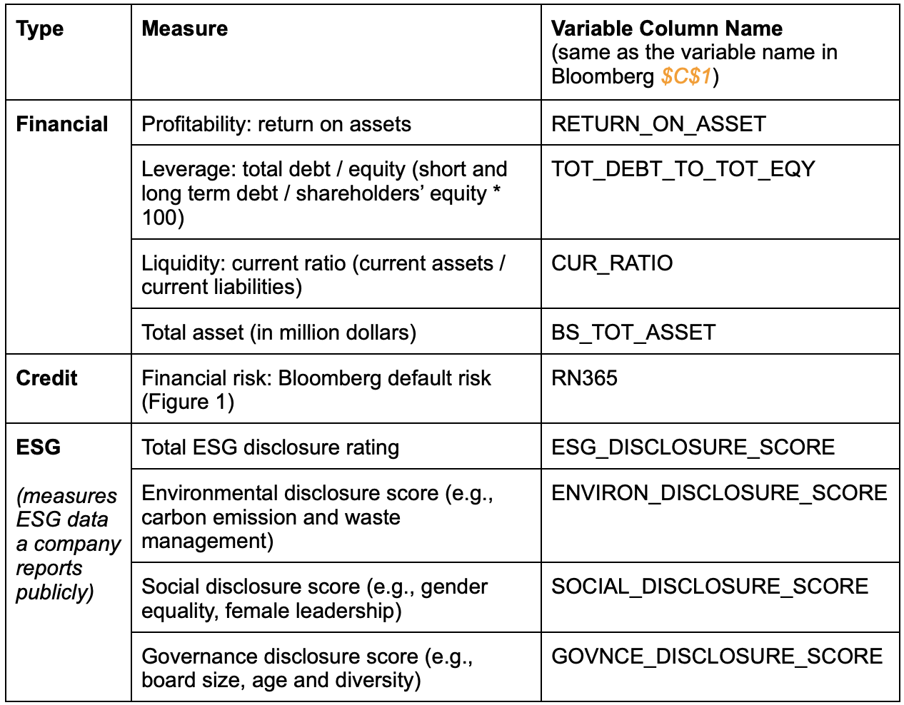

# ESG Impact on Financial Performance
## MBA Superwomen

 
**_You will never know who's who!_**
 

## Agenda
I.&nbsp;&nbsp;&nbsp;<a href='#introduction'>Introduction</a>  
II.&nbsp;&nbsp;<a href='#methodology'>Methodology</a>  
III.&nbsp;<a href='#results'>Results</a>  

## I.&nbsp;&nbsp;&nbsp;INTRODUCTION
### ESG Background

**ESG criteria** are a set of standards for a firm’s operations; refers to the three key factors when measuring the sustainability and ethical impact of an investment in a business or company  
-- **Environmental:** how a company performs as a steward of nature  
-- **Social:** examines how it manages relationships with employees, suppliers, customers, and the communities where it operates  
-- **Governance:** deals with a company’s leadership, executive pay, audits, internal controls and shareholder rights

  

**The Financial Times defines ESG as:**
> “A generic term used in capital markets and used by investors to evaluate corporate behavior and to determine the future financial performance of companies… [ESG] is a subset of non-financial performance indicators which include sustainable, ethical and corporate governance issues such as managing a company’s carbon footprint and ensuring there are systems in place to ensure accountability.”

**Paris Agreement in 2015:**

> After the Paris agreement, firms most exposed to climate transition risk also saw their ratings deteriorate whereas other comparable firms did not... These results have policy implications for corporate disclosures and strategies around climate change and the treatment of the climate-related transition risk faced by the financial sector (European Central Bank). 
 
> Over 100 companies have signed The Climate Pledge... It's part of a growing trend of corporations announcing climate targets in line with or ahead of those established by the Paris Agreement. In 2021 alone, 75 new companies have joined The Climate Pledge - bringing the total to 108 (Perillon). 

### <a href="https://www.mckinsey.com/business-functions/sustainability/our-insights/the-esg-premium-new-perspectives-on-value-and-performance">McKinsey - New Perspective on ESG (February 2020)</a>

-- **Increasing public and company _perception_** and pressure that ESG programs create short-term and long-term value  
-- **10%-15% median premium** to acquire a company with a positive ESG record over a company with a negative record (regardless of whether executives believe ESG programs have no effect on shareholder value)  

  

-- 58% of respondents say **the current political environment has _increased_** the importance of ESG programs  
-- Strengthening the organization’s **competitive position** and meeting **stakeholder expectations** for good corporate behavior  
-- The existence of high-performing ESG programs is **a proxy for good management**  

  

-- **Compliance** was cited as **the most important** aspect of ESG-related activities, rather than changing business processes to incorporate good ESG practices  

  

### Research Question
#### How do ESG ratings impact companies’ financial performance and credit rating?  
-- We will study and aggregate three individual ESG categories (Environmental, Social and Governance)  
-- We will then examine their impact on corporate financial performance including profitability and financial risk, as well as credit ratings  

### <a href="https://www.mdpi.com/2071-1050/13/7/3746/htm">Literature Review (Western University 2021)</a>

#### Objective
-- To examine the relationship between ESG factors and corporate financial performance, including profitability and financial risk  
-- To provide the rationale for ESG-integrated investment management strategies  

#### Data Used
-- S&P Capital IQ-Compustat database; from 1991 to 2013 based on 4708 firms in all industries, and combined with MSCI ESG dataset  

#### Findings 
-- **Positive effect** of ESG factors on corporate profitability, and the effect was more pronounced for larger firms  
-- Corporate governance **(G) has the most significant impact**, particularly for firms with weak governance  
-- Social factor **(S) has the most significant impact on credit rating**, while the environmental score surprisingly has a negative effect  
-- While the ESG factors seem to have **largely positive impact** on financial performance based on approximately 2200 studies, _**the research in this area is extensive, accelerating, and still inconclusive**_ depending on data sample, sample period, empirical methods and different industries or countries  

### Hypotheses
(1) ESG has a positive impact on corporate profitability  
(2) Among different ESG factors, governance category has the most significant impact on corporate finance performance  
(3) The Paris Agreement event has a positive impact on financial performance as it relates to ESG ratings  
(4) ESG factors have a significant correlation with corporate credit risks, which are measured by credit ratings  

## II.&nbsp;&nbsp;METHODOLOGY
### Data Collection 
#### Data Source
All data including financial ratios, ESG disclosure scores and default risk from **2011 to 2021** of **S&P 500 firms** were retrieved from **Bloomberg Terminals** located in the Rauch Business Center at Lehigh University  

#### Bloomberg Query Language
-- BDH is written in Excel in Bloomberg terminals to download the data in batches  
-- SPX Index retrieves information for S&P 500 firms  
-- BDH Example:  
`‘A US = B4& "EQUITY" = BDH(B3, $C$1, A3, A3, "Currency = USD", "Period = FY", "BEST_FPERIOD_OVERRIDE = FY", "FILING_STATUS = MR", "Sort = A", "Dates = H", "DateFormat = P", "Fill = —", "Direction = H", "UseDPDF = Y")’` 
&nbsp;&nbsp;&nbsp;&nbsp;- **B3 and B4** represent the ticker symbol  
&nbsp;&nbsp;&nbsp;&nbsp;- **C1** represents the variable name  
&nbsp;&nbsp;&nbsp;&nbsp;- **A3** represents the fiscal year  

-- Obtain credit rate data  
`- Download credit rate: = BDH(E1, D3, "1/1/2011", "12/31/2021", "cols = 2; rows = 2267")`  
&nbsp;&nbsp;&nbsp;&nbsp;- **E1** represents ticker symbol   
&nbsp;&nbsp;&nbsp;&nbsp;- **D3** represents RN365 (credit rating name)   
-- The other parameters will change according to the numbers of real data downloaded   
-- Get the average number of rating numbers in each year for every companies   
-- Keep the csv file and load into the jupyter lab to do the rest of data cleaning   

#### Variables 
 

  

  

#### Dataset Summary
 

  

### Data Transformation and Cleaning
-- The dataset is in a firm-year format. **Mean values of the ESG scores** and **financial ratios** were used when analyzing the relationship between the financial performance and ESG rating of the firms  
-- All ESG scores are expressed in a range **between 0.1 and 100**, from the very minimum governance data disclosed to all data disclosed, as collected by Bloomberg. Companies with zero disclosure will show a value of 0  
-- The dataset contains many missing values. As shown in Table 3, 17.4% of the current ratio and 11.5% of ESG disclosure, environmental disclosure, social disclosure and governmental disclosure each are missing. The **missing values were ignored** as part of this assessment  

  

-- The credit scores are based on the **Bloomberg default risk model**, expressed in a combination of numbers and letters  
-- 1-year default risk IG2 which represents an estimated 1-year default probability between 0.002%-0.004%. For the purpose of this analysis, the maximum value of the range was assigned to the corresponding risk (i.e., 0.004%)  
-- Bloomberg default risk of a subset of 154 firms were extracted and mean values were taken for each year from 2011-2021  

  

-- The dataset was also sliced into two sets (2011-2015 and 2016-2021) to compare the findings **pre- and post- Paris Agreement**  

### Relationship Analysis
-- **Visualization:** Correlation heatmap and scatter plots were used to visualize the relationship between different pairs of variables. Boxplots were used to visualize the changes over the years. All figures can be found in later sections  
-- **Regression analysis:** 16 multivariate regression models were constructed, 4 regressions for the profitability variable, aka. ROA, across all years. Another 8 regressions were constructed for the profitability variable to compare the effect before and after the Paris Agreement. 4 regressions with financial risks, aka. Bloomberg default risks. across all years. Nature log was applied to total asset observations to mitigate the potential issues related to measurement scaling. The following are the generalized regression formulas that were used in this analysis  
 
`RETURN_ON_ASSET = ɑ + 𝛽1(ESG_DISCLOSURE_SCORE, SOCIAL_DISCLOSURE_SCORE, GOVNCE_DISCLOSURE_SCORE or ENVIRON_DISCLOSURE_SCORE) + 𝛽2(TOT_DEBT_TO_TOT_EQY) + 𝛽3(CUR_RATIO) + 𝛽4(log(BS_TOT_ASSET) + e`  
 
`RN365 = ɑ + 𝛽1(ESG_DISCLOSURE_SCORE, SOCIAL_DISCLOSURE_SCORE, GOVNCE_DISCLOSURE_SCORE or ENVIRON_DISCLOSURE_SCORE) + 𝛽2(TOT_DEBT_TO_TOT_EQY) +𝛽3(CUR_RATIO) + 𝛽4(log(BS_TOT_ASSET) + e`  

## III.&nbsp;RESULTS
### Descriptive Statistics
**Table 3** below describes the summary statistics of the variables used to examine the first and second hypotheses. Overall, the size of this sample is 503 firms. Most of the corporate financial performance variables are accounting based indicators. The firm with median characteristics in the sample has an ROA of 6.68, Debt over Equity ratio of 508.90, total assets of about $6.65 billion and current ratio of 1.88. In terms of the ESG disclosure scores, the mean sample firm has an environmental disclosure score of 24.74, social score of 22.77, governmental scores of 86.32 and overall ESG score of 44.66. In addition, **firms did much better in governmental disclosures compared with environmental and social disclosures**. The lowest environmental disclosure is 0, meaning there are firms which didn’t disclose environmental related issues at all. In contrast, some firms scored 100 for governmental disclosure.

  

**Figure 3** below shows the change of different disclosure scores across 2011 to 2021 of all firms combined. Overall, **the means of all disclosure scores increased from 2011 to 2020**, with the largest increase in the environmental disclosure scores especially after 2015 when the Paris Agreement was signed by 196 countries in the world. However, all disclosure scores took a downward turn in 2021, which could potentially relate to Covid-19 pandemic. 

  

### Correlation Analysis
**Figure 4** below shows the correlation analysis using the average of 10-year observations of 504 firms dataset. Overall, there is **no strong correlation** between the variables of interest.  
-- First, all of the selected ESG disclosure scores appear to have **very weak negative correlation** to firms’ profitability (from -0.09 to -0.032)  
-- Second, **social disclosure scores** appear to have the **strongest correlation** to the firms’ profitability compared with others  
-- Third, the control variable (total assets) seems to have a moderate positive correlation to the profitability variable  

  

### Regression Analysis
#### ESG and Profitability
**Table 4** below shows the result of regression analysis using profitability as a dependent variable and the average of 10-year observations of firms as the input data. Overall, the adjusted **R2 values are low**, ranging between 0.12 to 0.13, but consistent for all the four models, potentially due to the limited number of independent variables selecte. 

Three out of four ESG related scores were **found significant** in the regression models - the overall ESG, environmental and government disclosure scores (p<0.05). In contrast, the social disclosure scores did not have a significant correlation with corporate financial performance. 

Based on the result, we **accept hypothesis 1** that ESG disclosure has a significantly positive impact on corporate profitability. In terms of the size of the impact, governance disclosure scores were found to be the most impactful compared with the other two. For 1 point increase in governance disclosure score, the firm’s ROA will increase by 0.17. Therefore, we also **accept hypothesis 2**. 

  

#### ESG and Profitability Pre- and Post-Paris Agreement
**Table 5** below shows the output of 8 regression analysis models using profitability as a dependent variable. The average of observations from 2011 to 2015 of firms dataset were used as input data for the left 4 models and the average of observations from 2016 to 2021 dataset were used  as the input data for the other 4 models. 

Overall, the adjusted **R2 values were much lower** for the 4 models using 2011-2015 datasets (0.04-0.06) than those using 2016-2021 dataset (0.2015 - 0.2042). The **2011-2015** regression models show similar results to the models using 2010-2021 datasets. **ESG, environmental and governance disclosure scores have significant and positive impact on the corporate profitability. Governance factors have the strongest impact, 1 point increase will lead to 0.21117 increase in ROA.**

However, the **2016-2021** regression models found **no significant correlations between any of the ESG disclosure scores and ROA**. This finding is consistent with the <a href="https://www.stern.nyu.edu/sites/default/files/assets/documents/ESG%20Paper%20Aug%202021.pdf">meta analysis studies</a> conducted by Tensie Whelan, Ulrich Atz, Tracy Van Holt and Casey Clark in 2021. They found that ESG disclosure on its own does not drive financial performance. Specifically, only 26% of studies that focused on disclosure alone found a positive correlation with financial performance compared to 53% for performance-based ESG measures (for example, directly assessing a corporate’s performance on greenhouse gas emission reductions or waste management).

Therefore, we **accept our hypothesis 3** that there are major differences in terms of impacts of ESG disclosure on financial performance of companies. 

  

#### ESG and Financial Risks
**Table 6** below shows the regression analysis using financial risks as a dependent variable and the average of 10-year observations of a subset of 154 firms dataset as the input data. 

All four ESG related scores were found **significant** in the regression models - the overall ESG, environmental and government disclosure scores (p<0.05). Therefore, we **accept our hypothesis 4** that ESG factors have a significant correlation with corporate credit risks, measured by default risk. 

Interestingly, the governance factors have a slightly negative correlation to corporate credit risks, while the other social factors, environmental factors and overall ESG have slightly positive impacts. 

  

  

## THE END
### Prof Bowen Back in January

  

### Now We'd Say...

  

## References
-- Kim,S.;Li,Z.(F.) (2021). Understanding the Impact of ESG Practices in Corporate Finance. Sustainability, 13, 3746. https://doi.org/10.3390/su13073746  
-- Tensie W., Ulrich A., Tracy V. and Casey C. (2021). ESG and Financial Performance: Uncovering the Relationship by Aggregating Evidence from 1,000 Plus Studies Published between 2015 – 2020.  
-- McKinsey (2020). The ESG Premium: New Perspectives on Value and Performance. https://www.mckinsey.com/business-functions/sustainability/our-insights/the-esg-premium-new-perspectives-on-value-and-performance  

## Appendix: Python Codes
<a href="https://github.com/faz320/MBAsuperwomen/blob/gh-pages/analysis_report/analysis_report.md">Analysis Report</a>

